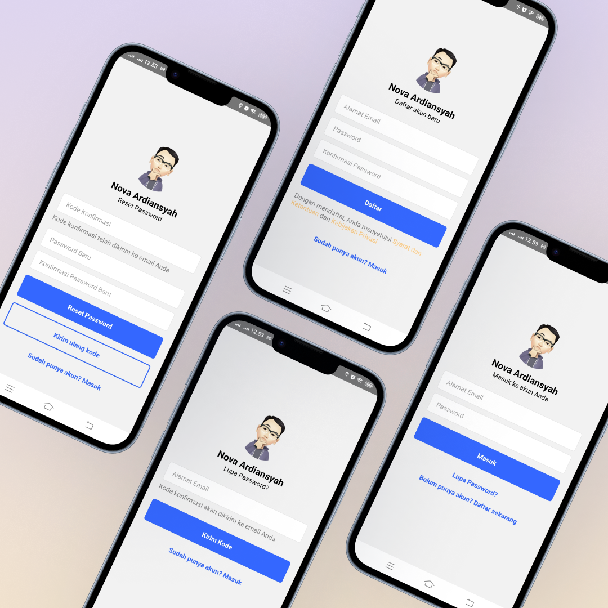

# Nova React Native Application
Hi Future Developer,

Welcome to my latest project! This is a React Native application designed for both Android and iOS devices, created to help manage finances, record important information, track sales, and handle various daily utilities.

While this application was initially developed for personal use, I have made the source code and a limited version of the API publicly accessible. You can find the API repository at [novaapp-api](https://github.com/novaardiansyah/novaapp-api). Please note that sensitive information such as environment variables, tokens, and direct database access are not included or shared.

## Electrifying Tech Stack!⚡

- [React Native](https://reactnative.dev/) 
- [React Navigation](https://reactnavigation.org/)
- [Typescript](https://www.typescriptlang.org/)

## Licensing Groove🕺

Exciting news! This project is grooving to the rhythm of the [MIT License](https://github.com/novaardiansyah/reactnative-novaapp/blob/main/LICENSE).

Feel free to use, modify, and share it with the world. Just remember to keep the original license intact. Let's spread the joy of coding together! 🚀

## Code of Conduct 🤝

We believe in fostering a welcoming and inclusive environment for everyone. Please be respectful, considerate, and constructive in all interactions. By participating in this project, you agree to uphold our [Code of Conduct](https://github.com/novaardiansyah/novaapp-api/blob/main/CODE_OF_CONDUCT.md). Let's collaborate and make this community awesome together!

## Let's Connect! 📞

Need to chat? Feel free to drop me a line via [Email](mailto:novaardiansyah78@gmail.com) or hit me up on [WhatsApp](https://wa.me/6289506668480?text=Hi%20Nova,%20I%20have%20a%20question%20about%20your%20project%20on%20GitHub:%20https://github.com/novaardiansyah/reactnative-novaapp). I'm just a message away, ready to groove with you! 📩

## Sneak Peek 🌟

Get a glimpse of the app's enchanting world by exploring the current progress here. Feast your eyes on these snapshots that showcase the app's dynamic essence.

## Project Status 🚀 

